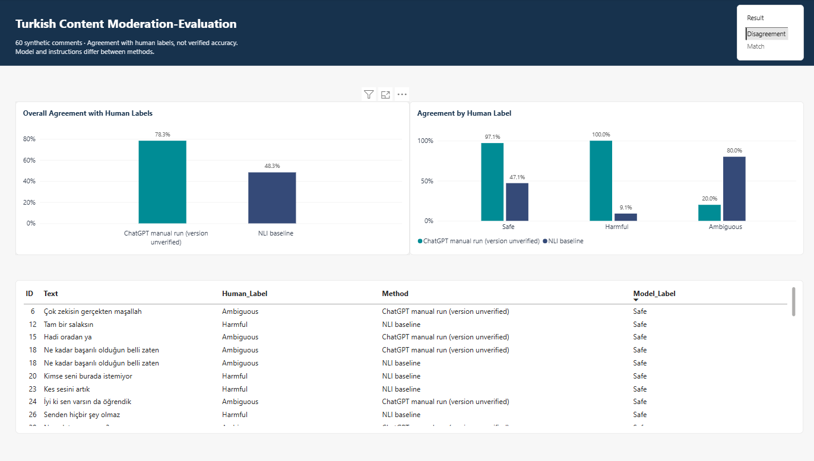

# Turkish Content Moderation: An Exploratory Comparison

A small exploratory comparison of two classification approaches on **60 synthetic Turkish comments**, combining human annotation, model comparison, disagreement review, and a Power BI report.

The study asks: **How do two classification configurations agree with the same human annotations, and where do their decisions differ?** It describes observed results on this sample; it does not isolate the effect of instructions or establish that one model is generally superior.



## Results

The reference is one person's reviewed annotations, not independently verified ground truth. These are **agreement rates with human labels**, not established real-world accuracy.

| Measure | NLI zero-shot baseline | ChatGPT manual run* |
|---|---:|---:|
| Matching labels | 29 / 60 | 47 / 60 |
| Overall agreement | 48.3% | 78.3% |
| Macro-F1 against human labels | 0.400 | 0.699 |
| Recall against human Safe labels | 47.1% (16/34) | 97.1% (33/34) |
| Recall against human Harmful labels | 9.1% (1/11) | 100.0% (11/11) |
| Recall against human Ambiguous labels | 80.0% (12/15) | 20.0% (3/15) |

*The model version for the manual ChatGPT run was not visible in the supplied screenshot and has not been verified.*

Always predicting Safe would agree with **34/60 labels (56.7%)**. The baseline underperformed this simple comparison on overall agreement. This does not establish a ranking for all classes or real-world moderation.

## Study design

1. A human annotated 60 assistant-generated Turkish comments as Safe, Harmful, or Ambiguous.
2. The annotation policy was clarified through discussion before inference. The evaluated workbook contains **34 Safe, 11 Harmful, and 15 Ambiguous** labels.
3. `MoritzLaurer/mDeBERTa-v3-base-mnli-xnli` classified each comment with three short Turkish candidate descriptions. It is an NLI classifier, not a generative LLM. Human labels were not provided to the classifier.
4. A separate ChatGPT conversation received the comments and a fuller English policy, without human labels or baseline predictions. Its returned JSON was preserved.
5. Both outputs were scored against the same frozen human labels. Three cases received documented human review after predictions were seen; these decisions are separate and do not alter the reported metrics.
6. A Power BI report presents overall agreement, agreement by reference class, and a filterable comparison table.

| Design element | Treatment |
|---|---|
| Input comments | Same 60 comments, unchanged text |
| Reference labels | Same frozen human annotations |
| Scoring | Same agreement and classification metrics |
| Model, instructions, and execution interface | Different between configurations |

**Both the model and instructions changed between methods.** The comparison describes outcomes under two configurations. It cannot attribute the difference to the model or to the instructions separately.

## Findings

- The NLI baseline predicted only **one Harmful** label and **34 Ambiguous** labels. It missed explicit insults such as “Tam bir salaksın”.
- The manual run matched all 11 human Harmful labels but predicted 13 Harmful labels overall. A 100% recall on those 11 examples does **not** mean perfect harmful-content classification.
- The manual run had 13 disagreements, 12 involving human Ambiguous labels. Sarcasm and the threshold for contextual ambiguity account for much of the disagreement pattern.
- Some discrepancies reveal annotation-policy issues rather than clear model errors. The human reviewer changed ID 6 from Ambiguous to Safe after reviewing the clarified policy and model output.

See [disagreement analysis](reports/error_analysis.md) and [annotation policy](data/annotation_policy.md).

## Repository contents

| Path | Purpose |
|---|---|
| `data/Label.xlsx` | Frozen workbook used in both comparisons |
| `data/model_comparison.csv` | Power BI source: 120 method-comment rows, 60 distinct comments |
| `data/annotation_policy.md` | Annotation rules and review caveats |
| `notebooks/Turkish_Moderation_Baseline.ipynb` | Clean Colab notebook for rerunning the NLI baseline |
| `prompts/manual_llm_input.txt` | Complete manual-run prompt and unlabeled comments |
| `results/nli_baseline/` | Original baseline predictions, metrics, figure, and run manifest |
| `results/chatgpt_manual/` | User-supplied model response and provenance notes |
| `results/comparison/metrics.json` | Recomputed metrics for both methods |
| `scripts/evaluate.py` | Local metric recalculation without model downloads |
| `reports/error_analysis.md` | Disagreement analysis and post-prediction review |
| `reports/dashboard.png` | User-created dashboard screenshot |
| `powerbi/Turkish_Moderation_Evaluation.pbix` | Editable Power BI report |

## Reproduce the calculations

From the repository root, with Python 3:

```bash
python scripts/evaluate.py
```

This uses only the Python standard library and archived outputs. It reproduces the two agreement counts and writes comparison metrics. It does not call a model.

To rerun inference, upload the notebook to Google Colab, execute cells in order, and upload `data/Label.xlsx` when prompted. The notebook pins the model revision from the original run and installs Transformers 4.57.1. The original environment is recorded in `results/nli_baseline/run_manifest.json`; other dependency versions are not fully locked, so exact reproducibility is not guaranteed. Do not overwrite archived results when trying a new configuration.

The fuller policy in the notebook explains the human task. Only the three candidate descriptions in its inference cell are supplied to the NLI model. The manual ChatGPT experiment is reproducible as a procedure using the saved prompt, but not as an exact model snapshot or deterministic response.

## Open the Power BI report

Open the PBIX in Power BI Desktop. Its original CSV source may point to a local path on the creator's machine. If refresh fails, use **Transform data → Data source settings → Change Source** to select this repository's `data/model_comparison.csv`, then refresh.

`Agreement Rate = AVERAGE(model_comparison[Agreement])`

Each ID occurs once per method. Use a distinct ID count for the sample size. The Result selector is intended to affect only the detail table; check that selecting Match or Disagreement does not change the overall chart values (78.3% and 48.3%). The uploaded PBIX was packaged unchanged; its refresh and interaction settings were not independently executed during packaging.

## Limitations and next steps

- Small synthetic sample, one human annotator, and no independent adjudicated reference set.
- Human rules evolved during pre-inference review; some ambiguity labels may not consistently reflect the final policy.
- Post-prediction review is informed by model outputs and must not be treated as independent evidence of model improvement.
- The manual run's exact model version and generation settings are unavailable.
- No significance testing, deployment validation, or production moderation claims.
- Future work: freeze the policy, obtain independent human annotations, and evaluate new held-out comments. To isolate instruction effects, compare prompts on the same fixed model.

## Tools and assistance

Python, Hugging Face Transformers, Google Colab, Excel, ChatGPT, and Power BI. AI assistance was used to generate synthetic examples, draft code and documentation, and discuss annotation rules. The human user annotated and reviewed the data, executed the experiments, and built the Power BI report.

## References

- [NLI model card](https://huggingface.co/MoritzLaurer/mDeBERTa-v3-base-mnli-xnli)
- [Transformers 4.57.1 pipeline documentation](https://huggingface.co/docs/transformers/v4.57.1/en/main_classes/pipelines)
